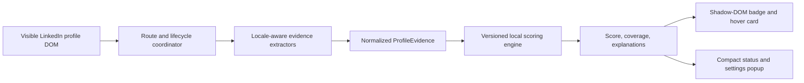

# Profile Prism Extension — Implementation Plan

> **Version 0.3/model-v2 update:** Section 14 supersedes the historical version-one scoring and no-automation constraints retained below for auditability.

## 1. Product decision

Build a public desktop browser extension that adds an explainable `0–100` authenticity-evidence score beside a person's name on a supported LinkedIn profile page.

The extension targets:

- Chrome and Microsoft Edge on desktop.
- Firefox on desktop.
- Safari on macOS.
- English, Portuguese, and Spanish LinkedIn interfaces.
- IT recruiters and software engineers initially, without making the product role-specific.

Mobile browsers, message analysis, job-post analysis, external lookups, and backend services are outside version 1.

## 2. Honest meaning of the score

The product name is **Profile Prism**. The public metric name is **Profile evidence**, which keeps the brand separate from the heuristic result.

The score means:

> How strongly the information currently rendered on this profile page is consistent with a genuine, human-controlled professional profile and free of common fake-profile warning signs.

It does **not** establish that:

- The member is legally who they claim to be.
- Every employment or education claim is true.
- The account has not been compromised.
- The member is not, and will never be, a scammer.
- A recruiter, candidate, job, message, link, or attachment is safe.
- The person is suitable for employment or a professional relationship.

Public listing and UI copy must say "summarizes visible authenticity signals," not "verifies people," "detects scammers," or "calculates the probability that someone is real."

The result must never automatically report, block, hide, rank, reject, or otherwise act on a person.

Version 1 must not offer bulk profile scoring, sorting, candidate filtering, exports, recruiter decision recommendations, or an API. Although recruiters are part of the expected audience, the first release is a personal safety/context aid and is not marketed as an employment-screening product.

## 3. User experience

### 3.0 Automatic evaluation and control

After installation and site-access approval, evaluation starts automatically whenever a supported profile page opens. It requires no toolbar action. The score is calculated locally from currently rendered information and is refreshed as LinkedIn renders more of that profile.

The compact toolbar popup links the privacy policy and field-level data inventory and provides an **Automatic scoring** pause switch. Pausing removes the badge and stops profile processing until the user turns it back on.

### 3.1 Badge

Insert the badge on the logical trailing side of the name, normally the visual right side:

```text
Person Name  [72]
```

Requirements:

- Always display a numeric score on a supported profile page.
- Show the number with a `/100` scale; never rely on color alone.
- Support mouse hover, keyboard focus, screen readers, zoom, and reduced motion.
- Use a neutral gray treatment whenever evidence coverage is below 40%, even if the numeric score is high or low.
- Prefer an adjacent extension-owned host in LinkedIn's name row. On older block-level H1 layouts that provide no usable row, append only the isolated host as the heading's final phrasing child so the score remains beside the name; never replace or rewrite the name.
- Isolate extension styles in a Shadow DOM.
- If the correct name anchor is not available yet, keep observing the page and retry as LinkedIn renders; never attach to an uncertain element.

### 3.2 Hover/focus card

The card shows:

```text
Profile Prism evidence: 72 / 100
Weighted checks inspected: 63% — Partial

Supporting evidence
• A native LinkedIn profile-verification badge is visible
• Work chronology is internally consistent

Caution evidence
• Activity visible on the page is very recent

Unavailable or not loaded
2 checks are not available yet; they have not lowered the score.

Safety / scam behavior: Not assessed

Heuristic assessment of visible profile information.
Not identity verification or a determination of fraud.
```

Show the three most influential supporting and caution contributions first, including their signed point impact. Keep additional observed contributions in an accessible disclosure inside the hover card. Summarize unavailable checks as a count so missing page data does not dominate the interface; the toolbar popup never shows profile score details.

When coverage is below 40%, begin the card with:

> Insufficient visible evidence: only a small share of profile signals is available so far. Missing checks do not lower the score; treat this as an early estimate.

The score may update as the user scrolls and LinkedIn renders more of the same profile page. The initial estimate must never scroll or open page controls automatically. Version 0.3 may scroll the current profile and temporarily inspect the native **About this member** dialog only after the user presses **Complete scan**.

### 3.3 Score bands

| Score | UI description |
|---:|---|
| 0–34 | Several caution signals — verify independently |
| 35–64 | Inconclusive |
| 65–84 | More supporting signals |
| 85–100 | Strong supporting signals — not a guarantee |

Coverage overrides presentation, not the number:

| Coverage | Label | Badge treatment |
|---:|---|---|
| 0–24% | Very low evidence | Neutral |
| 25–39% | Low evidence | Neutral |
| 40–69% | Partial visible evidence | Neutral/blue; show contributions but suppress score-band interpretation |
| 70–100% | High evidence | Score-band treatment |

## 4. Historical version 1 scoring contract

This section documents the superseded version-one model. Version 0.3 uses the model-v2 contract in section 14.

Each observation has:

```ts
type Observation<T> = {
  state: "observed" | "absent" | "unavailable";
  value?: T;
  extractionConfidence: number; // 0..1
  source: string;
};
```

Each scoring signal has a value from `-1` to `+1`:

- `-1`: strong caution evidence.
- `0`: neutral or not applicable.
- `+1`: strong supporting evidence.

The formula is:

```text
score = clamp(5, 95, round(50 + 0.5 × Σ(weight × signal × extractionConfidence)))
coverage = Σ(weight × extractionConfidence) / 100
```

The displayed scale is `0–100`, while the uncalibrated ruleset intentionally avoids absolute `0` and `100`. A completely unavailable profile produces a score near `50` with very-low-evidence presentation.

Rules:

- `unavailable` contributes nothing.
- Information hidden by privacy settings, not loaded, below a lazy-load boundary, or absent from a DOM experiment is `unavailable`, not `absent`.
- Missing LinkedIn verification is neutral because verification is optional and not universally available.
- A weak signal can never create the lowest band by itself.
- Require caution evidence from at least two independent signal families before showing a score below 35.
- Professional photos, large networks, company logos, polished writing, and high activity are easy to manufacture and receive capped positive credit.

### 4.1 Initial weights

| Criterion | Weight | Version 1 rule |
|---|---:|---|
| Native LinkedIn profile-verification badge | 12 | Visible badge in the profile name row: `+1`; otherwise: `0` |
| Workplace or education verification | 6 | Workplace: `+0.7`; education: `+0.4`; both capped at `+1`; absence: `0` |
| Account age, only if already rendered | 8 | `<30d: -1`; `30–179d: -0.6`; `180d–2y: -0.2`; `2–5y: +0.3`; `>5y: +0.6` |
| Work-history detail and specificity | 14 | Several substantive dated roles: `+1`; adequate for visible career stage: `+0.5`; established claim with empty/vague history: `-0.7` |
| Career chronology plausibility | 12 | Rich coherent chronology: `+1`; merely consistent: `+0.4`; material date contradiction: `-1`; gaps/concurrent contracts: `0` |
| Cross-section consistency | 12 | Headline/About/Experience/Skills strongly align: `+1`; partial alignment: `+0.4`; material conflict: `-1` |
| Claimed-company affiliation evidence | 6 | Exact linked employer plus specific role: `+0.5`; material employer-identity conflict: `-1`; unlinked/self-employed/“Confidential” alone: `0` |
| Core profile completeness | 8 | Several substantive core sections: `+1`; adequate: `+0.4`; at least three confirmed visible-but-empty core sections: `-1` |
| Activity distributed over time | 7 | Distributed over years: `+1`; at least six months: `+0.5`; sudden near-duplicate burst plus another thin signal: `-1`; dormant/none: `0` |
| Genuine reciprocal engagement | 5 | Varied specific interaction over time: `+1`; some genuine exchange: `+0.4`; repeated generic pattern: `-1`; none/unavailable: `0` |
| Connections/followers relative to visible profile maturity | 4 | Plausible: `+0.2`; `<30` only with established recruiter/senior claim and another thin signal: `-1`; high count alone: `0` |
| Recommendations and mutual social proof | 3 | Several specific recommendations across people/time: `+1`; some: `+0.4`; repeated boilerplate: `-1`; absent: `0` |
| Visible EN/PT/ES content specificity | 2 | Concrete technologies/projects/outcomes: `+1`; wholly generic repeated text: `-1`; unsupported language: `q=0` |
| Default or non-person profile image | 1 | `-1` only when both new and broadly thin; otherwise: `0`; any present personal image: `0` |

### 4.2 Signals explicitly excluded

Never score or infer:

- Race, ethnicity, nationality, country of origin, gender, age, disability, religion, or socioeconomic status.
- Names that appear unusual, foreign, shortened, transliterated, or recently changed.
- Location by itself.
- Grammar, accent, emoji use, or non-native writing.
- School prestige.
- Career gaps, freelancing, consulting, overlapping roles, career changes, or multiple concurrent jobs by themselves.
- Graduation year, inferred career age, or any attempt to infer a person's age. Work dates may be used only for internal work-history consistency.
- Facial identity, ethnicity, age, gender, attractiveness, or emotion.
- Whether a profile photograph is AI-generated.

The extension performs no facial recognition, biometric processing, reverse-image search, or photo upload.

### 4.3 Out-of-scope high-value evidence

Do not imply these were checked:

- Corporate email and domain consistency.
- Reverse-image or duplicate-profile searches.
- Employer website, employee roster, or official job-site checks.
- Messages, attachments, links, job offers, interview behavior, payment requests, or requests for sensitive data.
- Resume, email, phone, or application identity comparisons.

Show a concise unavailable-check count and state explicitly that missing checks do not lower the score.

## 5. Architecture



No profile information crosses the device boundary.

### 5.1 Repository layout

```text
/
  package.json
  tsconfig.json
  build/
    manifests/
      base.json
      chrome.json
      edge.json
      firefox.json
      safari.json
    build.mjs
    package.mjs
  src/
    content/
      content-entry.ts
      route-coordinator.ts
      mount-controller.ts
      scan-controller.ts
    extractors/
      profile-extractor.ts
      top-card.ts
      verification.ts
      experience.ts
      core-sections.ts
      activity.ts
      network.ts
    scoring/
      evidence-schema.ts
      rules-v2.ts
      evaluate.ts
      explanations.ts
    platform/
      browser-api.ts
      messages.ts
      storage.ts
    ui/
      badge.ts
      hover-card.ts
      popup-entry.ts
      popup.ts
      styles.ts
    locales/
      extraction/
        en.ts
        pt.ts
        es.ts
    _locales/
      en/messages.json
      pt_BR/messages.json
      pt_PT/messages.json
      es/messages.json
      es_419/messages.json
  fixtures/
    en/
    pt/
    es/
  tests/
    unit/
    extractor/
    ui/
    e2e/
  privacy/
    privacy-policy.md
    data-inventory.md
  public/
    popup.html
    popup.css
    content.css
    localized privacy pages
  store-assets/
    chrome-web-store/
  store-listing/
    en/
    es/
    pt-BR/
  dist/
    chrome/
    edge/
    firefox/
    safari/
  artifacts/
```

### 5.2 Browser runtime

Use Manifest V3 WebExtensions and a static content script restricted to supported LinkedIn profile URLs. The exact manifest match pattern must be limited to the required LinkedIn hosts and `/in/*` route family.

Version 1 needs no background process or service worker. Avoiding one reduces bundle size and sidesteps browser differences around Manifest V3 background execution.

Use a minimal promise-based browser API adapter for `storage`, `runtime`, and `i18n`. Do not request:

- `<all_urls>`
- cookies
- browsing history
- downloads
- web request interception
- private LinkedIn APIs
- internal GraphQL endpoints
- authentication tokens

The base manifest is intentionally small:

```json
{
  "manifest_version": 3,
  "name": "__MSG_extensionName__",
  "description": "__MSG_extensionDescription__",
  "version": "0.1.0",
  "default_locale": "en",
  "permissions": ["storage"],
  "content_scripts": [
    {
      "matches": ["https://www.linkedin.com/*"],
      "js": ["content.js"],
      "run_at": "document_idle"
    }
  ],
  "action": {
    "default_popup": "popup.html"
  }
}
```

Do not duplicate the match as a `host_permissions` entry unless a future extension page must fetch or inject programmatically. Use `storage.local`, not `storage.sync`, and store preferences only.

The Firefox manifest overlay must add a stable publisher-controlled ID and explicitly declare zero collection/transmission:

```json
{
  "browser_specific_settings": {
    "gecko": {
      "id": "profile-prism@germanao",
      "strict_min_version": "142.0",
      "data_collection_permissions": {
        "required": ["none"]
      }
    }
  }
}
```

The published Gecko ID is stable and must not change across updates.

### 5.3 LinkedIn SPA and DOM resilience

- Normalize and validate `/in/{profile_id}/` URLs.
- Keep one debounced `MutationObserver` and compare the URL before extracting again.
- Mount idempotently with an extension-specific `data-*` marker.
- Prefer semantic headings, accessible names, and structural relationships over generated CSS classes.
- Maintain ordered selector strategies with extraction-confidence values.
- Rescore only affected sections when lazy-loaded DOM appears.
- Never repeatedly scan the full document for every mutation.
- Remove the prior badge and evidence when SPA navigation changes profiles.
- Sanitize all text and build UI with DOM APIs and `textContent`, never profile-derived `innerHTML`.

## 6. Cross-browser build and distribution

| Browser | Runtime package | Store/distribution work |
|---|---|---|
| Chrome | Chromium MV3 ZIP | Chrome Web Store listing, privacy disclosure, permission justification |
| Edge | Same Chromium code with target manifest transform | Separate Microsoft Partner Center submission and localized listing |
| Firefox | Shared WebExtensions code plus Gecko manifest fields | Define a stable Gecko add-on ID, validate, submit source if requested, obtain Mozilla signing, publish on AMO |
| Safari macOS | Shared web-extension resources packaged for Safari | Apple Developer membership, Safari packaging, TestFlight validation, App Store Connect review |

Produce separate reproducible artifacts from one tagged source revision:

```text
dist/profile-authenticity-chromium-{version}.zip
dist/profile-authenticity-firefox-{version}.zip
dist/profile-authenticity-safari-{version}.zip
```

Do not treat Playwright's WebKit engine as proof of Safari extension compatibility. Test the packaged extension in actual Safari before release.

Use Apple's browser-based Safari Web Extension Packager in App Store Connect as the default packaging path for this Windows-hosted project. It can package the shared web-extension ZIP through Xcode Cloud without local Xcode. A real macOS/Safari environment is still required for meaningful debugging and release validation.

## 7. Localization

Separate two localization concerns:

1. **Extension UI:** `_locales` messages for English, Brazilian and European Portuguese, Spanish, and Latin-American Spanish.
2. **Evidence extraction:** normalized dictionaries for LinkedIn section labels, date tokens, number formats, and accessibility labels in English, Portuguese, and Spanish.

Requirements:

- No scoring rule may depend on grammar quality.
- Normalize Unicode and whitespace without removing semantic accents.
- Parse localized month names and duration formats with deterministic tests.
- Fall back safely to `unavailable` when a section label or date cannot be interpreted.
- Maintain human review of published translations and review all localization changes before release updates.
- Localize store descriptions, screenshots, permission explanations, hover copy, privacy policy, and support material.

## 8. Privacy and security

Version 1 has no backend, analytics, telemetry, advertisements, or remote configuration.

Data policy:

- Analyze rendered profile information in memory.
- Never persist names, profile URLs, profile contents, photographs, scores, or evidence.
- Persist only user preferences, extension version, and ruleset version.
- Never transmit profile data or browsing activity.
- Never load remotely hosted executable code.
- Remove production console logging of profile-derived data.
- Use an extension Content Security Policy that permits bundled resources only and no outbound connections.

The public release includes an accurate privacy policy and store data-use declarations explaining local webpage processing and zero transmission. Do not claim “we collect no data” without qualification: browser stores treat reading and locally processing webpage content as handling user data. State precisely that visible fields are processed ephemerally on-device and are neither retained nor transmitted.

Security controls:

- Dependency lockfile and automated vulnerability review.
- Minimal dependencies and no UI framework.
- Sanitized messages between content script and popup.
- No arbitrary URL fetch or navigation capability.
- Reproducible release archives and checksums.
- Protected store-publisher accounts with phishing-resistant MFA.

## 9. Quality plan

### 9.1 Unit and property tests

- Every scoring boundary and band.
- Scores always remain within the version 1 `5–95` implementation range.
- Missing verification never lowers a score.
- `unavailable` evidence never behaves as `absent`.
- One weak signal cannot produce the lowest band.
- Coverage is monotonic as confidently extracted evidence is added.
- Contributions sum exactly to the displayed score.
- Explanation order matches contribution magnitude.
- The same input always produces the same score and explanations.

### 9.2 Fairness tests

- Change only name, pronouns, photograph, location, or interface language; the score must remain stable unless a scored structural fact actually changes.
- Cover name changes, transliteration, career breaks, freelancing, concurrent roles, new graduates, private profiles, and dormant profiles.
- Compare false-caution behavior across English, Portuguese, and Spanish fixtures.
- Confirm that no protected-trait field exists in the evidence schema.

### 9.3 Extractor fixtures

Maintain sanitized synthetic fixtures for:

- Recruiter, engineer, executive, freelancer, student, and career changer.
- New complete profile and old thin profile.
- No-photo and private profiles.
- Consistent and materially contradictory timelines.
- Verification present and absent.
- Lazy-loaded sections and partially rendered pages.
- Duplicate headings, DOM reordering, and selector failures.
- English, Portuguese, and Spanish interfaces.

### 9.4 UI and accessibility

- One badge only after repeated DOM changes.
- Correct teardown/remount after SPA navigation.
- Hover and keyboard-focus parity.
- Escape dismissal and sensible focus order.
- Screen-reader names for score, coverage, and criteria.
- 200% zoom, narrow desktop window, dark mode, high contrast, and reduced motion.
- Non-color communication of every status.

### 9.5 Performance budgets

- No UI framework.
- Runtime JavaScript budget: at most 75 KB gzip per browser target.
- Total extension package, excluding store media: at most 250 KB where packaging permits.
- No outbound runtime requests.
- Typical incremental extraction and scoring: under 50 ms with no long task over 50 ms.
- Debounce mutation handling and avoid whole-page rescans.

### 9.6 End-to-end validation

- Automated Chromium and Firefox testing against a local synthetic single-page profile site.
- Browser-specific unpacked/sideloaded tests.
- Actual Safari packaged-build tests and App Store release validation.
- Manual smoke tests using synthetic or expressly consented test profiles only.
- No unattended live LinkedIn crawling in CI.

## 10. Calibration plan

Because no labeled examples exist now, version 1 remains a heuristic evidence index.

Calibration is a separate, opt-in research project and must not silently collect data from extension users.

Future dataset requirements:

- Consented authentic profiles confirmed independently of the scored features.
- Confirmed impersonations, fake profiles, or platform-removed profiles rather than unverified accusations.
- Separate labels for genuine profile, impersonation, compromised account, and uncertain.
- Coverage across languages, regions, career stages, industries, profile ages, and privacy levels.
- Person-, copied-profile-cluster-, and time-separated train/test splits.

Measure calibration error, Brier score, log loss, precision, recall, and false-positive rate. Choose caution thresholds primarily from a strict false-positive target. Only after successful calibration may public copy use "estimated likelihood."

## 11. Delivery milestones and exit criteria

### Milestone 0 — Product claims and scope

- Public terminology and non-affiliation/trademark rules are approved.
- Desktop-only scope and Safari macOS assumption are accepted.

### Milestone 1 — Scoring library

- Evidence schema, weights, coverage, hard safeguards, and explanations implemented.
- Unit, property, fairness, and localization tests pass.
- Scoring library has no browser or DOM dependency.

### Milestone 2 — Local fixture application

- Synthetic profile SPA exercises lazy loading and navigation.
- Badge, hover card, popup, and insufficient-evidence behavior pass accessibility tests.

### Milestone 3 — Chromium integration

- The visible-page extractor works without private APIs or automated navigation.
- Chrome and Edge builds pass performance and privacy gates.

### Milestone 4 — Firefox and Safari ports

- Firefox-specific manifest, ID, signing candidate, and AMO validation complete.
- Safari package runs in actual Safari and passes App Store release validation.

### Milestone 5 — Public release

- EN/PT/ES translations and store assets reviewed.
- Privacy policy, support page, permission rationale, and limitation copy published.
- Reproducible artifacts built from one tagged revision.
- Cross-browser smoke tests complete.
- Store screenshots and reviewer fixtures use synthetic profiles unless each depicted member has expressly consented.

### Milestone 6 — Public store operation

- Maintain the published Chrome Web Store, Edge Add-ons, Firefox AMO, and Apple App Store listings.
- Use staged rollout for updates where the store supports it.
- Monitor store-review feedback and crashes without collecting profile data.

## 12. Release acceptance checklist

- The score is always numeric on successfully parsed supported pages.
- Low coverage is clearly described and visually neutral.
- Every score is reproducible from visible evidence and a versioned ruleset.
- Users can inspect supporting and caution criteria plus a concise unavailable-check count on hover or focus.
- No profile data is stored or transmitted.
- No private API or hidden navigation occurs. Scrolling and native verification-dialog inspection happen only after an explicit **Complete scan** action and stay within the current profile.
- No demographic, geographic, linguistic, facial, or prestige proxy is scored.
- Store copy does not claim identity verification, fraud detection, or calibrated probability.
- Product name, icon, badge shape, and colors do not imitate LinkedIn's logo or verification badge.
- The product warns against using the score as the sole basis for recruiting, employment, reporting, blocking, or trust decisions.
- All four browser families pass their platform-specific release gates.

## 13. Primary references

- [LinkedIn: Identifying Fake LinkedIn Profiles](https://www.linkedin.com/top-content/networking/linkedin-professional-guidelines/identifying-fake-linkedin-profiles/)
- [LinkedIn: Report fake profiles](https://www.linkedin.com/help/linkedin/answer/a1338436/report-fake-profiles)
- [LinkedIn: Verifications on your profile](https://www.linkedin.com/help/linkedin/answer/a1359065/verified-information-on-your-profile?lang=en)
- [Chrome: Content scripts](https://developer.chrome.com/docs/extensions/develop/concepts/content-scripts)
- [Chrome: Extension internationalization](https://developer.chrome.com/docs/extensions/reference/api/i18n)
- [Chrome Web Store: User data requirements](https://developer.chrome.com/docs/webstore/program-policies/user-data-faq/)
- [Microsoft Edge: Publish an extension](https://learn.microsoft.com/en-us/microsoft-edge/extensions/publish/publish-extension)
- [Mozilla: WebExtension Chrome incompatibilities](https://developer.mozilla.org/en-US/docs/Mozilla/Add-ons/WebExtensions/Chrome_incompatibilities)
- [Mozilla: Submitting an add-on](https://extensionworkshop.com/documentation/publish/submitting-an-add-on/)
- [Apple: Safari extensions](https://developer.apple.com/safari/extensions/)
- [Apple: Packaging Safari Web Extensions with App Store Connect](https://developer.apple.com/documentation/safariservices/packaging-and-distributing-safari-web-extensions-with-app-store-connect)

## 14. Version 0.3 implementation contract

Version 0.3 keeps the automatic initial estimate and name-side badge, adds a bottom-left **Complete scan** FAB, and identifies its rules as `profile-evidence-v2`. The FAB and name badge share one accessible explanation card. The toolbar popup contains controls, scan status, language, and privacy links but no scoring criteria.

The route-owned scan coordinator maintains a memory-only evidence accumulator. On user activation it may inspect a unique native **About this member** control, parse only structured verification/account-history observations, close the dialog, and scroll the current profile in steps no larger than 75% of the scroll viewport. Each step waits for 300 ms of relevant mutation quiet, capped at 1.5 seconds. Completion requires the four-pixel bottom threshold, stable scroll height across three checks, 800 ms of mutation quiet, and no scoped busy/progress indicator. The scan has 20-second and 40-step hard limits; timeout or unreadable verification content is partial, never complete.

The modal scan surface blocks background interaction and exposes an explicit Cancel control plus Escape. The scan also cancels on route or scroll-container replacement, document hiding, extension pause, or teardown. Unavailable observations never erase accumulated evidence. A successful scan returns the selected profile scroll surface to the top before publishing completion.

Model-v2 coverage weights total 100: generic native badge 2, structured verification 14, account history 10, maintenance 4, work detail 12, chronology 10, cross-section consistency 10, company affiliation 7, core completeness 8, activity 7, reciprocal engagement 5, network 4, recommendations 3, content specificity 3, and profile image 1.

The score is `round(50 + confidence-adjusted direct impacts)`, clamped to 5–99 after safeguards. Structured verification is capped at +15: government ID +12, current-employer work email +10, former/unresolved work email +6, and education +5. Verification continuity adds +1 at 6–11 months or +2 at 12+ months. Account tenure adds +1 at 6 months–2 years, +4 at 2–5 years, or +8 at 5+ years. One/both recently updated contact-or-photo fields add +1/+2; older updates are neutral. Positive profile impacts are work detail +9/+4, chronology +8/+3, cross-section consistency +7/+3, linked company +4, core completeness +5/+2, activity +4/+2, reciprocal engagement +2/+1, recommendations +2/+1, specific content +2, and plausible network +1. Explicit caution impacts remain for material contradictions, vague histories, suspicious activity bursts, boilerplate engagement/recommendations, and compound new/thin/default-image patterns.

Scores above 89 require a completed full scan, at least 70% coverage, an explicit verification method from the native dialog, account tenure of at least two years or six months of activity, three positive non-verification families, and no material chronology/employer/cross-section conflict. Coverage below 40% caps at 64; coverage from 40–69% caps at 84; a generic badge without inspected details caps at 89; a material contradiction caps at 64; the absolute cap is 99.

Release 0.3.0 remains gated on anonymized structured calibration fixtures: the three supplied anchor profiles, at least four medium established legitimate profiles, four legitimate new/private profiles, four confirmed suspicious/fake/impersonation profiles, and verified-but-contradictory plus potentially compromised-old-account controls. Impacts may move at most ±2 from the provisional table. Optimize first for zero safeguard violations, then anchor target bands, then minimum deviation from provisional impacts. The result remains a heuristic evidence-strength index, never a calibrated probability.
